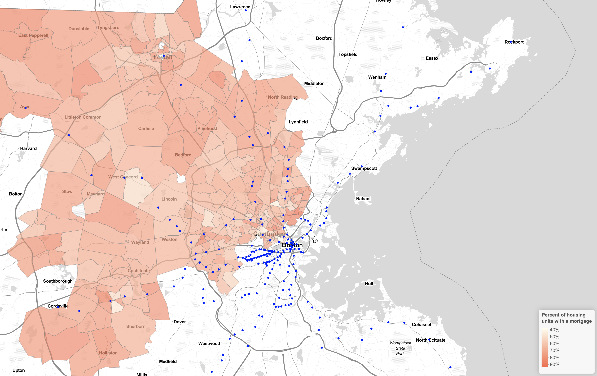
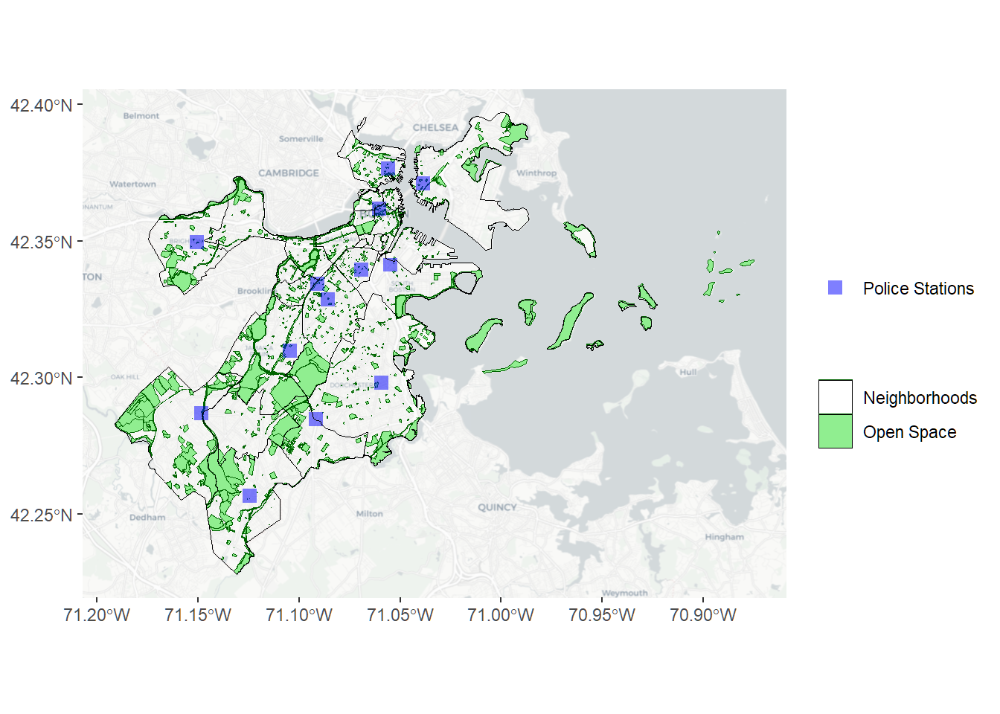
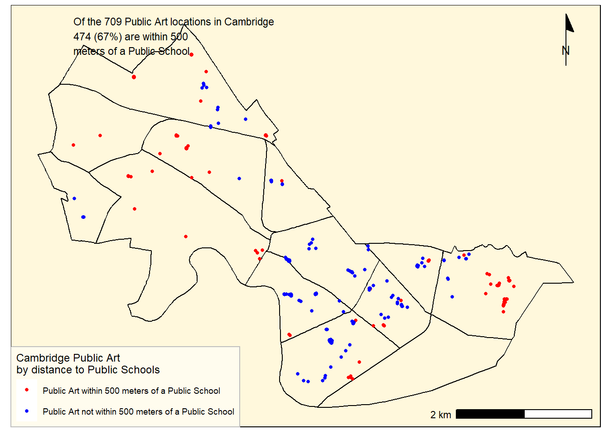
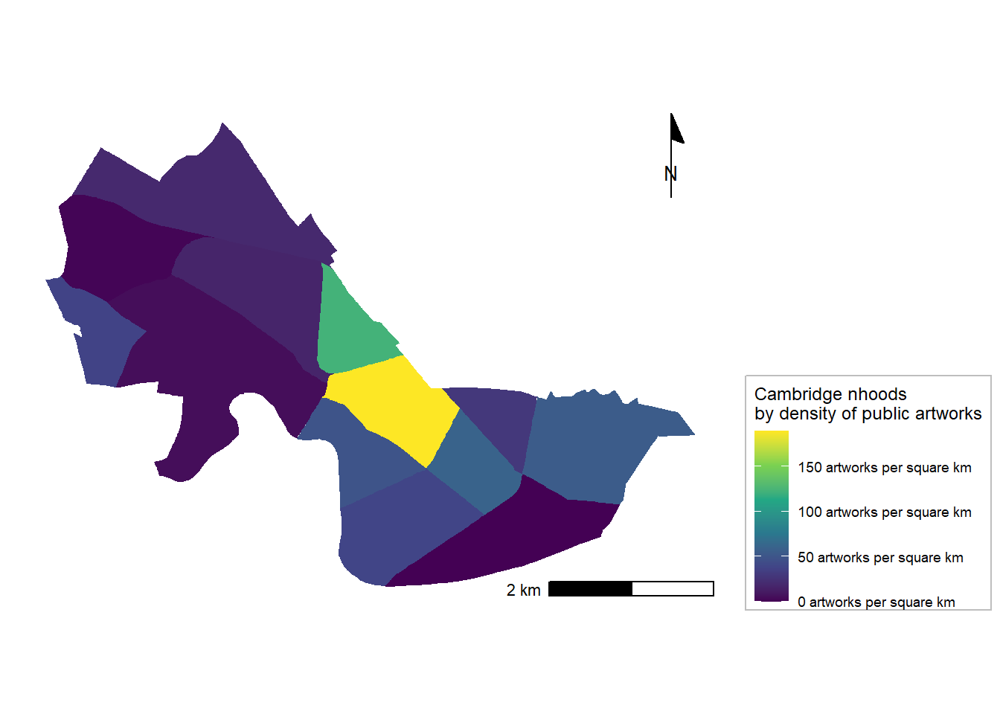
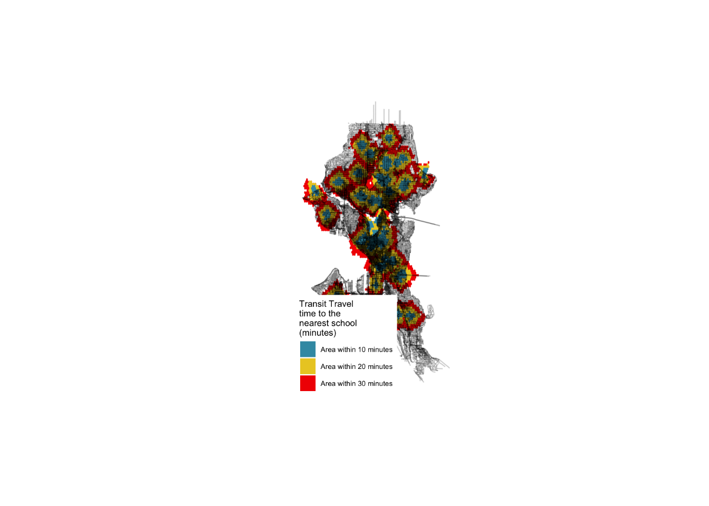
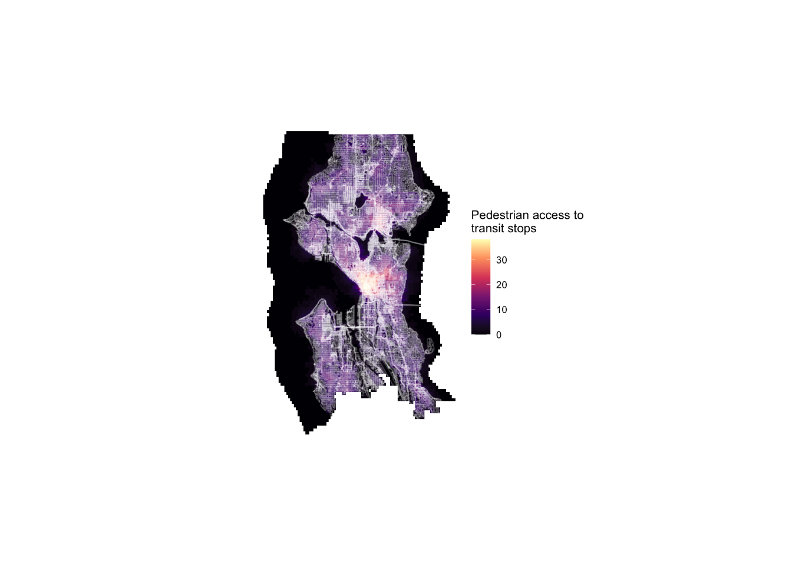

```{r setup, include=FALSE}
knitr::opts_chunk$set(echo = TRUE)
```

# Introduction

This website is an online collection of maps displaying different data points I created using R Studio. This portfolio showcases a few of the skills I learned during the first half of the semester at the Masters in Urban Planning Program at Harvard GSD.

# Maps of Boston, MA 
The following displays two different Maps of Boston with different information about the city

## Interactive Map of Boston
This interactive map of Boston displays the percentage of housing units with a mortgage 

[](https://raniakaramallah.github.io/final_portfolio/fullsize/Boston-interactive.html){target="_blank"}

## Where are the Police Stations in Boston?
This Map shows the location of police stations in Boston relative to each neighborhood and green open spaces in the city.

[](https://raniakaramallah.github.io/final_portfolio/fullsize/Boston-police stations.png){target="_blank"}

# Maps Cambridge, MA
These two maps of Cambrdige also displays different data in the city

## Public schools in Cambridge
This map of Cambridge shows the number of public artworks within 500 meters of all public schools

[](https://raniakaramallah.github.io/final_portfolio/fullsize/Cambridge-walkability to art.png){target="_blank"}

## Public Artwork in Cambridge
This map of Cambridge shows the density of public artwork in each of Cambridge neighborhoods.

[](https://raniakaramallah.github.io/final_portfolio/fullsize/Cambridge-density of art.png){target="_blank"}

# Map of Philadelphia, PA
Geo-referencing the city of Philadelphia 
Overlays of Maps from the year of 1779 - and the year the of 2021. The historical map from 1779 depicts the region of Philadelphia between the Delaware and Schuylkill rivers. During this time, Philadelphia’s urban fabric was limited in extent; the street grid extended to only around the modern-day Old City neighborhood. The less developed land was depicted to be open space, family farms, and homes.  

[](https://raniakaramallah.github.io/final_portfolio/fullsize/Philadelphia-georefrencing.pdf){target="_blank"}

# Maps of Seattle, WA
These two maps of Seattle shows walkability to schools and accessibility through public transit

## Schools in Seattle
This map shows isochrones based on transit travel times to the nearest school. 

[](https://raniakaramallah.github.io/final_portfolio/fullsize/Seattle-schools.png){target="_blank"}

## Transit Accessibility
This map shows accessibility based on a distance-decay function of the walking time to the nearest transit stop. 

[](https://raniakaramallah.github.io/final_portfolio/fullsize/Seattle- transit.png){target="_blank"}
